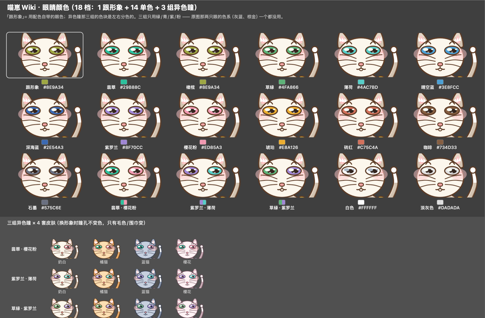
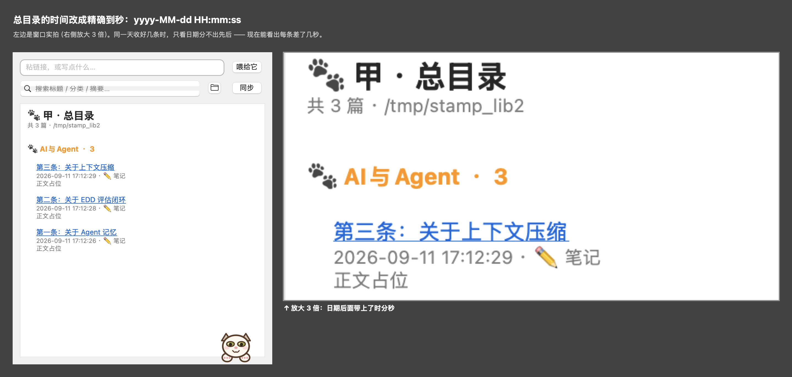

# MiaoZang · 喵藏

[](#install)
[](LICENSE)
[](#the-engine)
[](#why-no-ai)
[](README.md)

**The cat on your desktop that eats up your bookmarks.**

Drag a link onto the cat → it extracts the article, classifies it by topic, saves it into a local Markdown library on your machine → and maintains a master index automatically.

**Fully local · No AI · No subscriptions.**


> 🇨🇳 **完整中文文档见 [README.md](README.md)** — this English page is a condensed introduction.

---

## What it does

```
Drag a link onto the cat / feed the clipboard / paste into the index window
                    ↓
      Extract → classify by keywords → write Markdown → update index
```

Three entries, one pipeline. Every save produces the same trio, all inside your library folder:

| File | What it is |
|---|---|
| `<category>/YYYY-MM-DD_Title.md` | The article itself, with front-matter |
| `INDEX.md` | Human-readable master table, clickable |
| `.catalog.json` | Machine-readable index |

Web pages are saved as **digests** (summary + key points + outline), not full-page dumps.
Notes you type are stored **byte-for-byte**, untouched.

Up to **two cats** at once — each with its own library, look, and language.

## The cat is the app

- 100% vector-drawn with `NSBezierPath` (106 paths) — crisp at any size
- It blinks, flicks its tail, and its mouth moves gently while idle
- Drag it anywhere; it remembers its spot
- **259,200 possible looks**: 4 coat themes × 9 eye styles × 18 eye colors × 4 bibs × 4 ears × 5 tails × 5 mouths



Double-click the cat to toggle the index window (a searchable table where clicking a title opens the article).



## Install

### macOS 13+ (one-click)

Grab **`喵藏-1.1.0.dmg`** from the [**Releases**](https://github.com/zhangxuanchen/MiaoZaiWiki/releases) page, open it, and drag **喵藏.app** into Applications.

```
Open DMG → drag MiaoZang.app to Applications → double-click to start
```

> First launch shows "unidentified developer"? Right-click the app → **Open**, or run:
> `xattr -dr com.apple.quarantine /Applications/喵藏.app`

### Windows / Linux: the engine as an Agent Skill

The desktop cat is macOS-only (it's AppKit + custom drawing), but the **archiving engine is cross-platform**. Copy `dist/miao-zang/` into your agent's skills directory:

| Agent | Copy to |
|---|---|
| Claude Code | `~/.claude/skills/miao-zang/` |
| WorkBuddy / CodeBuddy | `~/.workbuddy/skills/miao-zang/` |
| Any `SKILL.md`-compatible agent | its skills dir, keep the folder name `miao-zang` |

Or use it as a plain CLI:

```powershell
cd dist\miao-zang\scripts
powershell -ExecutionPolicy Bypass -File setup.ps1
.venv\Scripts\python.exe fetcher.py --init-library ~\Documents\MyLibrary
.venv\Scripts\python.exe fetcher.py --root ~\Documents\MyLibrary https://example.com
```

> The two web-fetching dependencies (trafilatura / bs4) are **optional**.
> Notes, library setup, indexing and browsing all run on the standard library alone.

## Why no AI?

Classification is **layered weighted keyword matching**: the title (×5), page description (×3), outline headings (×2) and body (×1, first 6000 chars) are scored separately; English keywords match on word boundaries (`go` never hits `google`), single words are capped to fight spam, and broad keyword coverage scores higher than repetition. Twenty-two default categories ship out of the box (tech, business, creative, academic, lifestyle — see the Chinese README for the full list), tunable via a JSON file that travels with the library. Summaries come from the page's own `og:description`, falling back to a rule-based extractive picker. The result: **deterministic, millisecond-fast, zero cost, zero network calls** — and your notes never leave your machine.

Want LLM summaries instead? `make_digest()` in `fetcher.py` is plain text-in / text-out — swap in a model call and you're done.

## Architecture

```
        ┌──────────────┐         ┌──────────────────┐
        │  MiaoZang.app│         │  miao-zang skill │
        │ window · cat │         │ any agent · CLI  │
        └──────┬───────┘         └────────┬─────────┘
               └──────────┬─────────────┘
                 ┌────────▼─────────┐
                 │  fetcher.py      │  extract · classify · save · index
                 └────────┬─────────┘
                 ┌────────▼─────────┐
                 │  one library format │  md + .catalog.json + INDEX.md
                 └──────────────────┘
```

The shell (Swift, ~4800 lines) talks to the engine (~1260 lines of Python) only through "a command line + one line of JSON". That's why the same engine powers the app, the CLI, and the agent skill.

## License

- **Code**: MIT — see [LICENSE](LICENSE)
- **The cat** (character design, app icon, all artwork): **All rights reserved** — not covered by the MIT license; do not copy, redistribute, or use commercially without permission
- Content fetched from the web belongs to its original authors; this tool is for personal archiving only
- No telemetry, no accounts, no network access except when *you* feed it a link
