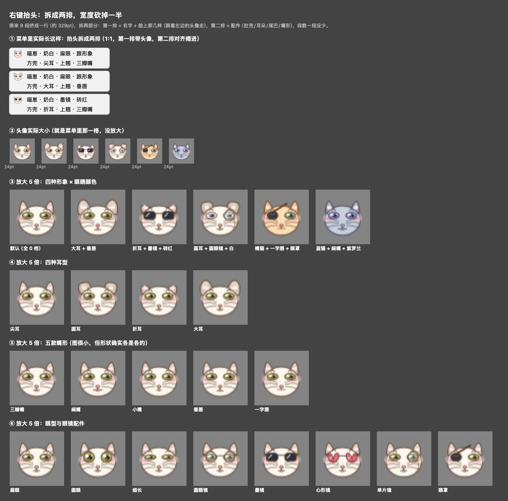
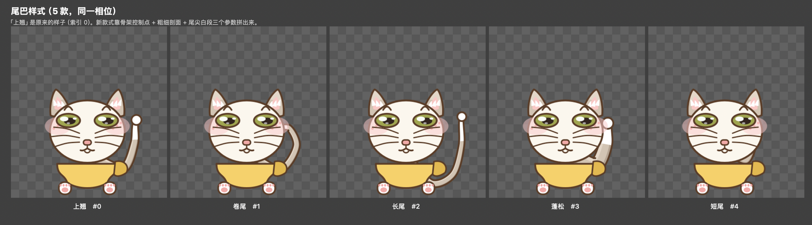
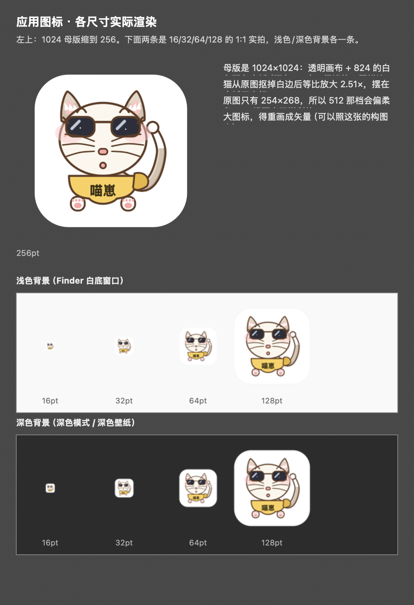

# 喵藏


**桌面上的那只猫，帮你把收藏夹吃干净。**

拖个链接过去 → 它抓正文、按主题分类、存进你电脑里的一个文件夹 → 自动维护一份总目录。
**纯本地 · 不用 AI · 不花一分钱。**

- macOS：一只悬浮在桌面的矢量自绘小猫（`NSBezierPath`，106 处，缩到多小都不糊）
- Windows / Linux / macOS：同一套归档引擎（纯 Python），装成 Agent Skill 或命令行都能用
- 零第三方 UI 依赖，只用系统框架；macOS 13+ · AppKit · Swift

---

## 快速安装

### macOS：一键装（推荐）

下载 **`dist/release/喵藏-1.0.0.dmg`**，双击打开，把 **喵藏.app** 拖进「应用程序」：

```
打开 DMG → 拖 喵藏.app 到 应用程序 → 双击启动
```

- 首次打开若提示「来自身份不明的开发者」：**右键 → 打开**，或执行
  `xattr -dr com.apple.quarantine /Applications/喵藏.app`
- 想让它开机自己出来：右键桌面上的猫 →「开机自动启动」打勾
- 想重新打包 / 换版本号：`MIAOZANG_VERSION=1.1.0 bash dist/build_app.sh`
- DMG 是 ad-hoc 签名（无开发者证书），仅供个人与内部分发；上架 App Store 需另做开发者签名与公证

### macOS：从源码装（开发者 / 想改代码）

```bash
xcode-select --install        # 只做一次（Xcode 命令行工具，带 swiftc 和 python3）
cd <项目目录>
bash build.sh                 # 编译 + 安装 + 启动，可反复跑，配置和书库不会被动
```

`build.sh` 会自动：在 `~/.catpet/` 放引擎 → 找一个可用的 `python3`（自动探测）建虚拟环境并装抓网页依赖 → 编译 Swift、打包 `喵藏.app` 到 `~/Applications/` → 启动 → 迁移旧登录项。
只想装不启动：`MIAOZANG_NO_LAUNCH=1 bash build.sh`。

```bash
~/.catpet/catpet.sh start | stop | restart | status
~/.catpet/catpet.sh autostart on | off | status
```

### Windows：安装「基本功能」（Agent Skill / CLI）

桌面猫是 macOS 专属，但**归档引擎跨平台**——Windows 上你得到同一套"存链接 → 分类 → 建书库"的能力，只是没有猫。

**方式一：装成 Agent Skill（最省事）**

把 `dist/miao-zang/` 整个目录复制到你的 Agent 技能目录：

| Agent | 放到 |
|---|---|
| Claude Code | `~/.claude/skills/miao-zang/` |
| WorkBuddy / CodeBuddy | `~/.workbuddy/skills/miao-zang/` |
| 其它支持 `SKILL.md` 的 Agent | 它的 skills 目录下，目录名保持 `miao-zang` |

然后直接跟 Agent 说："存一下这个链接" / "帮我记下来" / "整理我的收藏"。

**方式二：命令行直接用**

```powershell
cd dist\miao-zang\scripts
powershell -ExecutionPolicy Bypass -File setup.ps1      # 一次性：建 .venv + 装依赖
.venv\Scripts\python.exe fetcher.py --doctor            # 体检
.venv\Scripts\python.exe fetcher.py --init-library ~/Documents/我的书库
.venv\Scripts\python.exe fetcher.py --root ~/Documents/我的书库 <链接>
```

> 抓网页的两个依赖（trafilatura / bs4）装不上**不影响基本功能**：
> 记笔记、建书库、整理索引、浏览目录全部只用标准库，只有"把网页转成本地 md"需要它们。

---

## 它做什么

三个入口，汇进同一条流水线：

```
拖链接到猫身上 / 右键喂剪贴板 / 总目录里粘一条
                    ↓
      抓正文 → 关键词分类 → 写成 markdown → 更新总目录
```

产出永远是这三样（都在书库根目录下）：

| 文件 | 是什么 |
|---|---|
| `<分类>/YYYY-MM-DD_标题.md` | 正文本身，带 front-matter |
| `INDEX.md` | 总目录表格，给人看、可点开 |
| `.catalog.json` | 机器可读索引（总目录窗口读它） |

**它不存整页、不存图片**：网页存的是"摘要 + 要点 + 大纲"（`kind: digest`）。
随手记的东西**逐字节原样保存**，一个字不改。

最多同时养**两只**，各有各的书库、各有各的形象和语言。

---

## 怎么用

| 操作 | 行为 |
|---|---|
| **拖链接到猫身上** | 抓取 → 分类 + 摘要 → 存盘 → 冒泡提示 |
| **双击猫** | 打开应用内的**总目录窗口** |
| **单击猫** | 随机冒一句 |
| **右键猫** | 下表的菜单 |
| **拖动猫** | 位置自动记忆（每只各记各的） |
| **拖进文件以外的东西** | 当成笔记原样保存 |

右键菜单（抬头那两行会**列出这只猫现在的全部形象**，一眼知道右键的是谁）：

```
[头像] 喵藏 · 奶白 · 扁眼 · 跟形象
       方兜 · 尖耳 · 上翘 · 三瓣嘴
────────────────────────────
🐟  喂食剪贴板链接
────────────────────────────
📖  打开总目录
🔄  同步书库索引
────────────────────────────
🎨  形象 · 👀 眼型 · 🫒 眼睛颜色
🧣  肚兜 · 👂 耳朵 · ➰ 尾巴 · 👄 嘴形
🌐  语言
🚀  开机自动启动
────────────────────────────
🐱  再养一只喵 / 👋 送走这只喵
🌙  退出喵藏
```



**总目录窗口**是所有操作里最常用的：可搜索、可点标题直接开文章、顶上还有一条输入框
（粘链接或写笔记，回车就喂给它）。时间**精确到秒**，连着收几篇也看得出先后。


---

## 形象：7 个维度

| 维度 | 档数 | 说明 |
|---|---|---|
| 形象（配色主题） | **4** | 奶白 / 橘猫 / 蓝猫 / 樱花 |
| 眼型（含眼镜配件） | **9** | 扁眼 · 圆眼 · 细长眼 · 墨镜 · 心形镜 · 星星镜 · 圆框镜 · 单片镜 · 眼罩 |
| 眼睛颜色 | **18** | 含「跟形象走」一档；其余是固定的瞳色 |
| 肚兜 | **4** | 方兜 / 尖角 / 圆兜 / 花边 |
| 耳朵 | **4** | 尖耳 / 圆耳 / 折耳 / 大耳 |
| 尾巴 | **5** | 上翘 / 卷尾 / 长尾 / 蓬松 / 短尾 |
| 嘴形 | **5** | 三瓣嘴 / 阔嘴 / 小嘴 / 垂唇 / 一字唇 |

**4 × 9 × 18 × 4 × 4 × 5 × 5 = 259,200 种组合**，每只猫各存各的那一份。


待机时嘴还会自己轻轻动（呼吸 4.6s / 抿唇 7.5s / 微张 11.3s，周期互质所以看不出是循环动画）；
眼睛会眨、耳朵会抖、尾巴会甩。**冻结一帧时这些全部停掉** —— 所以导出和回归比对不受影响。



---

## 存什么

**网页链接 → 摘要式**（`kind: digest`）：

```markdown
---
title: "文章标题"
url: https://...
saved: 2026-09-11 17:27:15
category: AI与Agent
kind: digest
summary: "一句话摘要（总目录里直接显示这行）"
author: ...
published: ...
---

## 摘要
（页面自带的 og:description；没有就从正文里抽 1~2 句）

## 要点
- 从正文里挑出的关键句（3~6 条，过滤掉"订阅/扫码"这类噪声）

## 大纲
- 小标题 1
- 小标题 2

---

原文：<https://...>
```

**随手记 → 原文**（`kind: note`）：front-matter 之后就是输入内容，**逐字节原样**，
markdown、缩进、代码块都不动。`summary` 只用于索引显示。

> 早期版本存过全文（`kind: full`）。那些文件和 `.html` 快照会**原样保留**，不会被改写。

---

## 存到哪儿

每只猫一个书库：`~/Documents/<猫名>/`（建猫时定死，之后不能改）。

```
喵藏/
├── INDEX.md                   总目录表格（时间 / 标题 / 分类 / 摘要 / 原文）
├── .catalog.json              机器可读索引
├── AI与Agent/
│   └── 2026-09-11_某某标题.md
├── 编程技术/
├── 产品与商业/
├── 生活与其他/
└── 收件箱/                    分类不出来的兜底桶
```

- **书库目录建好之后不能改**：猫名 = 目录名。想换就「送走这只喵」再「再养一只喵」
  （文件不会被删，同名目录会被认回来）
- **两只猫不能指向同一个书库**：存储层加载时判重，撞车的只从内存里搁置并冒泡提示，
  配置文件原样保留，你可以自己修
- 别的机器上拿到的书库可以直接用：拷过去、把 `root` 指过去就行

---

## 引擎（fetcher.py）

抓取、分类、落盘、索引全在 `fetcher.py` 里 —— 它是一个**独立的命令行**，
app 只是通过 subprocess 调它。所以你不用开 app 也能用：

```bash
PY=~/.catpet/venv/bin/python3        # 或者随便一个 python3

$PY ~/.catpet/fetcher.py --doctor                          # 体检（人可读 + 退出码）
$PY ~/.catpet/fetcher.py --where                           # 环境快照（JSON）
$PY ~/.catpet/fetcher.py --root ~/Documents/喵藏 --rescan   # 把索引跟磁盘对齐
$PY ~/.catpet/fetcher.py --init-library ~/Documents/新书库   # 建一个空书库
$PY ~/.catpet/fetcher.py --root ~/Documents/喵藏 <url>       # 抓一个链接
printf '%s' "随手记一条" | $PY ~/.catpet/fetcher.py --root ~/Documents/喵藏 --manual
```

**一个有用的特性：不装任何第三方包也能用一半。**
`trafilatura` / `bs4` 是懒加载的 —— 没装时 `--doctor` / `--where` / `--init-library` /
`--manual` / `--rescan` 全能跑，只有抓网页会优雅地报「trafilatura 未安装」。

引擎还有一份**可分发版本**（做成 AI Agent Skill，跨平台复用同一套能力）：`dist/miao-zang/`。

---

## 架构

```
        ┌──────────────┐         ┌──────────────────┐
        │  喵藏.app    │         │  miao-zang skill │
        │ 窗口 · 猫    │         │ 任意 Agent · CLI │
        └──────┬───────┘         └────────┬─────────┘
               └──────────┬─────────────┘
                 ┌────────▼─────────┐
                 │  fetcher.py      │  抓取 · 分类 · 落盘 · 索引
                 └────────┬─────────┘
                 ┌────────▼─────────┐
                 │  同一个书库格式   │  md + .catalog.json + INDEX.md
                 └──────────────────┘
```

**壳和引擎之间只有"命令行 + 一行 JSON"这一层接口。**
好处：引擎跨平台、可单独用、能被别的壳复用（上面的 skill 就是这么来的）。

| 文件 | 行数 | 是什么 |
|---|---|---|
| `main.swift` | ~4800 | 全部 UI：窗口、绘制、事件、菜单 |
| `fetcher.py` | ~1260 | 引擎（跨平台，只需要 Python） |
| `make_appicon.swift` | 90 | 应用图标合成（源图 → 1024 母版） |
| `build.sh` / `catpet.sh` | 350 | 安装 / 启停 |

---

## 分类规则

- `标题 + 标题 + 正文`（**标题权重 ×2**），逐个关键词数出现次数，分数最高的类胜出
- **全 0 分 → 落到「收件箱」**（兜底，不是失败）
- 分数相同时按**类名的字符编码**从大到小决胜（`sort` 比的是 `(分数, 类名)` 元组）
  —— 这是个隐藏耦合：**改分类名字会改变平票结果**
- 已抓过的 URL 自动跳过，提示「已经吃过了」
- 改词表**只对之后新喂的生效**；`--rescan` 不重新分类（它只认 front-matter 和文件夹名）

## 摘要怎么来的

不依赖任何 LLM，离线免费：

1. **摘要**：优先用页面自带的 `og:description` / `meta description`（人手写的，最准）；
   没有就从正文里按「位置靠前 + 长度适中 + 带数字 + 带总结性词」加权抽 1~2 句
2. **要点**：同一套打分取前 5 句，命中「订阅 / 扫码 / 私信」这类噪声的句子直接剔除
3. **大纲**：取正文的 h2 / h3

想要真正的 LLM 摘要（而不是抽取式），把 `make_digest()` 里那段抽句换成模型调用即可 ——
输入输出都是纯文本，接哪儿都行。

---

## 配置

`~/.catpet/config.json`（由 app 自己维护）：

```json
{
  "pets": [
    {"id": "174c3022", "name": "喵藏", "root": "~/Documents/喵藏",
     "look": 0, "eye": 2, "bib": 1, "ear": 0, "tail": 0, "mouth": 0,
     "eyeColor": 14, "lang": "zh", "x": 1647, "y": 307}
  ],
  "fallback": "收件箱",
  "categories": [
    {"name": "AI与Agent", "keywords": ["agent", "llm", "上下文", "mcp"]}
  ]
}
```

几个要点：

- **写盘是原子的**：先写 `.tmp` → 旧文件备份成 `.bak` → 替换。
  手滑改坏了可以从 `~/.catpet/config.json.bak` 捞回来
- **`categories` / `fallback` 归引擎管**，Swift 侧只读不写 —— 两边不会互相覆盖
- 想换一套分类词表：直接改 `categories`，下次抓取生效；
  或者（分发版里）在书库根目录放 `.miao-zang.json`，**跟书库走**
- 上限 `PetStore.maxPets`（改完重跑 `build.sh`）
- 自检：`~/Applications/喵藏.app/Contents/MacOS/MiaoZang --selftest`

## 书库自动巡检

每只猫启动后会说一个 **50~70 分钟的随机间隔**看一眼书库：
算一遍所有 `.md` 的内容指纹（`CryptoKit`），**跟上次不一样就说明书库被人动过** → 自动跑一次索引同步。

> ⚠️ 指纹**故意排除** `.catalog.json` 和 `INDEX.md` —— 它们每次写入都会变，
> 算进去会"自己触发自己"，变成死循环。这个坑踩过一次。

---

## 开发

```bash
bash build.sh                       # 编译 + 安装 + 重启
~/.catpet/catpet.sh restart         # 只重启
bash export_art.sh                  # 重导「猫崽角色设计_版权材料」（版权登记用）
```

- **快照**：每次改动前会把 `main.swift` 存一份到 `.snapshots/`，文件名带时间和改动说明
- **回归靠"渲染指纹"**：`CatView.renderTime` + `freeze(state:phase:at:)` 保证同一输入永远同一输出，
  算一份 FNV-1a 64 位的哈希。**改绘制代码前先记下当前指纹**，改完对比就知道默认档有没有被动到
- **离屏渲染**：`dataWithPDF(inside:)` 出矢量再栅格化，所以导出图样任意分辨率都清晰

> 一个反复踩的坑：**新增 per-pet 字段必须同时改 `load()` 和 `save()`** —— 漏一个就是"存了等于没存"。
> 另外枚举新档位**一律追加在末尾**（下标要落盘），插中间会让已有用户的设置串位。

### 打可分发 DMG

```bash
bash dist/build_app.sh                       # 产出 dist/release/喵藏-<版本>.dmg
MIAOZANG_VERSION=1.1.0 bash dist/build_app.sh   # 指定版本
```

引擎（`dist/.engine`，内嵌 Python 运行时）缺失时会自动先跑 `dist/make_engine.sh` 构建。
两个脚本都带**出货自检**（无个人路径 / 不含本机数据 / 签名校验），没过不会出货。

### skill 的软链接（本机）

`~/.workbuddy/skills/` 下有两条**软链接**指回这个项目 —— 这样改项目里的源，Agent 那边立刻生效：

```
~/.workbuddy/skills/miao-zang          →  <项目>/dist/miao-zang
~/.workbuddy/skills/macos-desktop-pet  →  <项目>/skills/macos-desktop-pet
```

> ⚠️ **移动或重命名项目目录后链接会断**（skill 就"消失"了）。重建：
>
> ```bash
> ln -sfn "$PWD/dist/miao-zang"           ~/.workbuddy/skills/miao-zang
> ln -sfn "$PWD/skills/macos-desktop-pet" ~/.workbuddy/skills/macos-desktop-pet
> ```
>
> 不想用链接的话，直接 `rsync -a --delete dist/miao-zang/ ~/.workbuddy/skills/miao-zang/`
> 拷一份实体进去也行（代价是每次改完要再同步一次）。

---

## 已知限制

- **桌面猫只在 macOS 上跑**。UI 层绑死 AppKit（106 处贝塞尔自绘 + 无边框透明悬浮窗），
  不是"改几个路径"能跨平台的。Windows / Linux 想用同款能力 → 用 `dist/miao-zang/` 那个引擎包。
- **抓不了**需要登录的页面、纯前端渲染的页面、反爬很强的站。
- **没有 robots.txt 检查、没有限速** —— 它是给"看到好文章顺手存一下"用的，别拿去批量爬站。
- **抓下来的内容版权归原作者**，只作个人存档阅读。
- 单只猫上限 2 只（`PetStore.maxPets`）。

## 打包 / 图标

应用图标是**多尺寸 `.icns`**，由 `make_appicon.swift` + `build.sh` 生成：

```
appicon_source.png  →  make_appicon.swift  →  appicon.png（1024 母版）
                                                ↓  sips 缩 5 档 ×2 + iconutil
                                          AppIcon.icns（放进 bundle）
```

换图只要替换 `appicon_source.png` 再跑一次 `build.sh`。



---

## 目录结构

```
MiaoZaiWiki/
├── main.swift                 全部 UI（窗口 / 绘制 / 事件 / 菜单）
├── fetcher.py                 引擎（跨平台 CLI）
├── make_appicon.swift         图标合成
├── Info.plist                 bundle 元信息
├── build.sh / catpet.sh       安装 / 启停
├── dist/
│   ├── miao-zang/             引擎的可分发版（AI Agent Skill 包，跨平台）
│   ├── build_app.sh / make_engine.sh   打 DMG / 内嵌引擎
│   └── release/               出货的 .dmg（本地构建，不入仓库）
├── docs/                      README 用的图
│
│   —— 以下是本地目录，已在 .gitignore 排除，克隆仓库看不到 ——
├── 发布/                      小红书等宣传配图
├── 猫崽角色设计_版权材料/      版权登记材料（含 66 款变体导出）
│   └── 侵权自查/              侵权风险自查文档 + 比对证据图
└── .snapshots/                每次改动的源码快照
```

---

## 许可与注意

- 代码是本项目自研，以 **MIT** 许可开源（见根目录 [LICENSE](LICENSE)）；
  依赖全部是宽松许可（MIT / BSD / Apache-2.0 / MPL / PSF），无 AGPL / GPL-only，声明附在 LICENSE 末尾
- **「喵崽」猫角色形象有版权**：应用图标（`appicon_source.png`）、README 插图与猫的全部
  美术设计（7 维度形象体系）**保留所有权利**，不在 MIT 许可范围内 —— MIT 只覆盖代码；
  未经许可请勿复制、二次分发或商用这些形象素材
- 抓取内容的**版权归原作者**，本工具仅供个人存档阅读，请勿二次分发抓来的内容