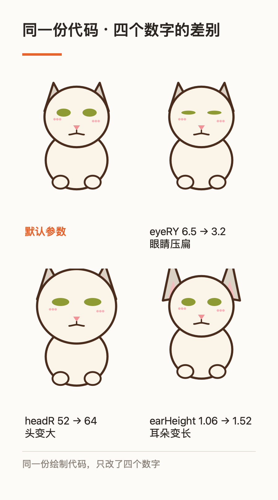

# 从零做一只桌面宠物 · 完整流程

> 配套代码：同目录的 `PetStarter.swift`（**可直接编译运行的最小骨架**）
> 配套图：`preview.png`（骨架的样子）、`parameter-demo.png`（改参数的对比）

---

## 这份文档给谁

给想自己做一只桌面宠物、但不确定从哪下手的人。

**不需要**会写 macOS 应用。需要的是：会用 AI 助手、愿意看图做选择、能接受"先跑起来再变好看"。

整个过程你只做一件事：**看图和做决定**。代码由 AI 写，但方向和质量由你控制 ——
这份文档主要讲的就是**怎么控制**。

---

## 先明白一件事：这不是「让 AI 写代码」

新手最容易踩的坑是把 AI 当"代码生成器"：描述需求 → 等代码 → 跑起来 → 不满意 → 再描述。

那样做，改到第十轮就会崩，因为**你没有任何手段判断"这次改动有没有弄坏之前的东西"**。

真正有效的方式是把工作拆成两边：

| 谁 | 干什么 |
|---|---|
| **AI** | 写代码、渲染预览图、跑检查、打包 |
| **你** | **看图，选一个** |

关键是 AI 要能把每个决定**渲染成图**给你看。做到这一点，你的每次介入只要几秒钟；
做不到，就会退化成"说不清 → 改 → 还是不对 → 再改"的消耗战。

---

## 整体流程

```
0. 准备        装好工具链，建一个空项目
1. 让它出现     最小可运行骨架：一只宠物出现在桌面上     ← 20 分钟
2. 变成参数     把「长什么样」收进一张参数表             ← 最重要的一步
3. 建立检查能力 离屏渲染 + 指纹                        ← 分水岭，别跳
4. 给它一件事做 一个独立的命令行引擎
5. 能发出去     图标、签名、安装包
6. 合规         对外之前必须过的一关
```

第 3 步是分水岭。跳过它，后面每一步都在赌；有了它，才敢一次改十几个地方。

---

## 第 0 步 · 准备

需要一个 macOS 环境 + Xcode 命令行工具：

```bash
xcode-select -p          # 有输出就说明装好了；没有的话运行 xcode-select --install
swiftc --version
```

建一个空目录当项目：

```bash
mkdir -p ~/Projects/my-pet && cd ~/Projects/my-pet
```

---

## 第 1 步 · 让它出现在桌面上

把 `PetStarter.swift` 复制进项目，然后：

```bash
swiftc -O -o MyPet PetStarter.swift
./MyPet
```

桌面上会出现一只坐着的猫，可以拖动、右键退出。

**这一步的产出**：一个真实存在的东西。别小看它 —— 有实体之后，后面每次改动都能立刻看到效果，
这个反馈循环是整个流程的动力来源。

### 代码里真正重要的只有三块

**① 窗口怎么造**（让它是个"挂件"而不是"应用"）

```swift
let panel = PetPanel(contentRect: ..., styleMask: [.borderless, .nonactivatingPanel], ...)
panel.isOpaque = false            // 窗口本身透明，只有宠物可见
panel.backgroundColor = .clear
panel.level = .floating           // 浮在普通窗口之上
panel.collectionBehavior = [.canJoinAllSpaces, .fullScreenAuxiliary]

app.setActivationPolicy(.accessory)   // 不出现在 Dock 里
```

**② 宠物怎么画**（纯代码画，不用图片）

```swift
override func draw(_ dirtyRect: NSRect) {
    drawBody(around: c)
    drawEars(around: c)
    drawHead(around: c)
    drawFace(around: c)
    drawBlush(around: c)
}
```

顺序就是图层顺序：后画的压在前面的上面。

**③ 形象怎么变成参数** —— 见下一步，这是全篇最要紧的地方。

---

## 第 2 步 · 把形象变成参数（关键）

骨架里有两个结构：`Palette`（颜色）和 `Geometry`（形状）。

```swift
struct Geometry {
    var headR: CGFloat = 52          // 头半径
    var eyeRX: CGFloat = 11.5        // 眼睛半宽
    var eyeRY: CGFloat = 6.5         // 眼睛半高 —— 改小 = 扁眼
    var earHeight: CGFloat = 1.06    // 耳尖高度
    var bodyR: CGFloat = 50          // 身体半宽
    ...
}
```

**全篇只有这一条铁律：绘制代码里不许出现魔数。**

想改眼睛形状，改 `Geometry.eyeRY`，不要去 `drawFace()` 里找那个 `6.5`。
这不是洁癖 —— 因为：

- 魔数散在代码里，AI 每次改都要重新找一遍，容易漏、容易改错
- 参数集中之后，"换一个形象"变成"换一组数字"，**这是以后能做出一批不同宠物的前提**
- 参数是"可枚举"的 —— 一组数字就是一个候选，AI 能一次给你 5 个候选让你挑

### 看这张图，它值得花十秒



**同一份绘制代码，只改了四个数字。** 这就是参数化的全部意义。

### 练习

改一个数字，重新编译，看变化：

```bash
# 让眼睛更扁
sed -i '' 's/var eyeRY: CGFloat = 6.5/var eyeRY: CGFloat = 3.0/' PetStarter.swift
swiftc -O -o MyPet PetStarter.swift && ./MyPet --render before-after.png
```

---

## 第 3 步 · 建立「看得见」的能力（分水岭）

到这里必须先停下来做一件事：**让程序能自己渲出一张图**。

骨架里已经有这个开关：

```bash
./MyPet --render out.png
```

它**不截屏**，而是直接让视图画到一块位图上。为什么要这样：

| 好处 | 为什么重要 |
|---|---|
| 不依赖屏幕 | 无桌面会话、多显示器、窗口被挡住 —— 都不影响 |
| 尺寸精确 | 能指定渲成任意尺寸，不受窗口大小限制 |
| **能精确复现** | 同一次改动前后渲两张图，可以逐像素比对 |
| 快 | 毫秒级，能进回归脚本 |

### 有了它，才能做「指纹」

把渲出来的图算一个哈希，改动前后比一下：

- 哈希一样 → **逐位相同**，这次改动绝对没有影响到任何别的像素
- 哈希不同 → 变了，再用像素比对看**变在哪**

```bash
./MyPet --render v1.png          # 改之前
# ...改代码...
./MyPet --render v2.png          # 改之后
# 比较两个文件的哈希
shasum -a 256 v1.png v2.png
```

**这一步的价值**：从"我看了好像没问题"变成"机器告诉我有没有问题"。

### 三层检查，回答三个不同的问题

| 层 | 工具 | 回答 |
|---|---|---|
| 全图指纹 | 哈希 | **有没有变？** |
| 差异范围 | 逐像素比对 + 包围盒 | **变的是不是只在该变的地方？** |
| 语义断言 | 数特定颜色的像素 | **变得对不对？** |

三层缺一不可。举个真实的例子：做"嘴巴微微张开"的效果时，第一版用描边色画了一条缝 ——
深色叠深色，整图只多出 6 个像素，**等于这个信号根本测不出来**。
换成"透出一点舌头色"之后变成 0 → 38 像素，图和断言同时变清楚了。

**判断一个断言好不好，就问：如果这是错的，我能测出来吗？**

### 练习

给自己定一条规矩，然后守住它：**"默认那档必须逐位不变"**。
以后每次加新功能，都先渲一次默认档、比哈希 —— 不一致就说明你碰到了不该碰的地方。

---

## 第 4 步 · 给它一件事做

光好看不够用。给它一个明确的功能，而且要**做成独立命令行**，不要和界面代码搅在一起。

理由：

- 能单独测试（不用开界面）
- 能单独分发（没有界面的平台也能用）
- 界面只管"调它 + 显示结果"，坏了不影响功能本身

一个最小的外形：

```bash
mytool --doctor                    # 体检：环境行不行
mytool --where                     # 环境快照（JSON，方便 AI 读）
mytool <输入>                       # 干活
```

**`--doctor` 和 `--where` 这两个命令要一开始就做。** 它们是给 AI 看的 ——
有了它们，AI 排查问题不用读源码，直接跑一条命令就知道环境哪里不对。

---

## 第 5 步 · 做成能发出去的 app

一个能跑的可执行文件不等于能发出去。最少还要三件事：

**① 应用图标**。macOS 图标是 `.icns`，从一张 1024×1024 的图开始：

```bash
mkdir -p AppIcon.iconset
# 用 while read 而不是 `for spec in ...; do set -- $spec` ——
# 后者在 zsh 里不会按空格切分单词（zsh 默认不做 word splitting），会静默出错。
while read -r size name; do
    sips -z "$size" "$size" icon-source.png --out "AppIcon.iconset/$name.png"
done <<'SIZES'
16 icon_16x16
32 icon_16x16@2x
32 icon_32x32
64 icon_32x32@2x
128 icon_128x128
256 icon_128x128@2x
256 icon_256x256
512 icon_256x256@2x
512 icon_512x512
1024 icon_512x512@2x
SIZES

iconutil -c icns AppIcon.iconset -o AppIcon.icns
```

**② 打包成 .app**：目录结构必须是

```
MyPet.app/Contents/
├── Info.plist          # 必须有 CFBundleExecutable / CFBundleIdentifier / LSUIElement
├── MacOS/MyPet         # 可执行文件
└── Resources/          # 图标等
```

`LSUIElement = true` 表示"不在 Dock 显示" —— 桌面宠物要这个。

**③ 签名**。没有 Apple 开发者证书时用 ad-hoc 签名：

```bash
codesign --force -s - MyPet.app
```

代价是：**别人下载后第一次打开会被系统拦住**，需要右键 →「打开」。
这个必须在下载页面写清楚，否则很多人会以为你发的是病毒。

---

## 第 6 步 · 合规（对外之前必须过）

自己用无所谓，一旦对外发布或收费，有三件事要查：

| 查什么 | 怎么查 |
|---|---|
| 形象来源 | 如果参考了别人的图，**来源必须明确**。自绘 / AI 生成 / 委托画师 / 网上找的，四种风险完全不同 |
| 依赖许可 | 列出所有第三方库的许可，确认没有 AGPL 这类传染性许可 |
| 名字 | 商标初查（注意：公开检索 ≠ 商标局检索，要下结论得去官方查） |

**"网上找的图"是最危险的一档** —— 自己当参考没人管，但**随产品分发就是另一回事**。

---

## 一天的节奏长什么样

这不是理论估计，是实际分布：

| 阶段 | 占比 | 说明 |
|---|---|---|
| 让东西跑起来 | 10% | 骨架 + 窗口 + 能拖动 |
| **形象调整** | **50%** | 几十轮"看图选一个"，每一轮几秒 |
| 建立检查能力 | 15% | 离屏渲染 + 指纹 + 断言 |
| 功能 | 15% | 通常是独立的命令行部分 |
| 打包 + 文档 | 10% | 一次性做完，以后复用 |

**一半时间花在"看图选一个"上** —— 这是正常的，也是值得的。
因为那是在打磨用户真正看得见的部分。

---

## 常见坑

**关于代码**

1. 绘制代码里写魔数 → 后面每次改都要重新找，必然漏
2. 加新选项时插在中间 → 如果选项下标会存进配置文件，插入会让老用户的设置错位。**新选项一律追加在末尾**
3. 绘制顺序错 → 后画的压在前面的上面，顺序 = 图层顺序
4. 每个功能项都要同时改"读取"和"保存"两处，漏一个就是"存了等于没存"

**关于验证**

5. 别用截屏做检查 —— 依赖屏幕、尺寸不固定、没法复现
6. 断言写得太弱：判据本身区分不出来，等于没有
7. **测试要注意缓存**：如果被测函数有缓存，第二次调用直接返回，测试里的清理逻辑根本不会执行 → 假通过
8. 改了源码忘了重新编译，却以为测试跑的是新代码 → 看着像"没生效"

**关于环境**

9. **任何跑得通的东西都要放进项目目录，不要放 `/tmp`** —— 系统重启会清空它
10. shell 脚本里 `$变量` 后面紧跟中文时，要写成 `${变量}`，否则中文首字节会被当成变量名的一部分
11. `set -o pipefail` 下，`ls xxx | head -1` 在没匹配时会变成致命错误，脚本静默退出（一句错误都不打印）

**关于分发**

12. 没签名 = 用户第一次打开被拦。下载页必须写清放行步骤
13. 打包前扫一遍：有没有把你的本地路径、配置、私人数据打进包里

---

## 检查清单

做完了对照一遍：

- [ ] 形象参数全部集中在 `Palette` / `Geometry`，绘制代码里没有魔数
- [ ] `--render` 能渲出图，不需要截屏
- [ ] 有一条"默认档逐位不变"的检查，而且它**真的会在出错时变红**（试过故意改坏吗？）
- [ ] 功能做成了独立命令行，有 `--doctor` / `--where`
- [ ] 能打出 `.app`，有图标，能签名
- [ ] 下载说明写清了"第一次打开被拦怎么办"
- [ ] 所有工具和脚本都在项目目录里，不在 `/tmp`
- [ ] 对外发布前查过形象来源、依赖许可、名字

---

## 最后

这套流程真正的产出不是"一只猫"，而是**一套你能重复用的东西**：
参数化的形象、能自检的渲染管线、独立的功能引擎、一键打包。

下一只宠物只需要改参数和名字，其余全部复用 —— 那时候你就不是在"做应用"，
而是在"生产"。
